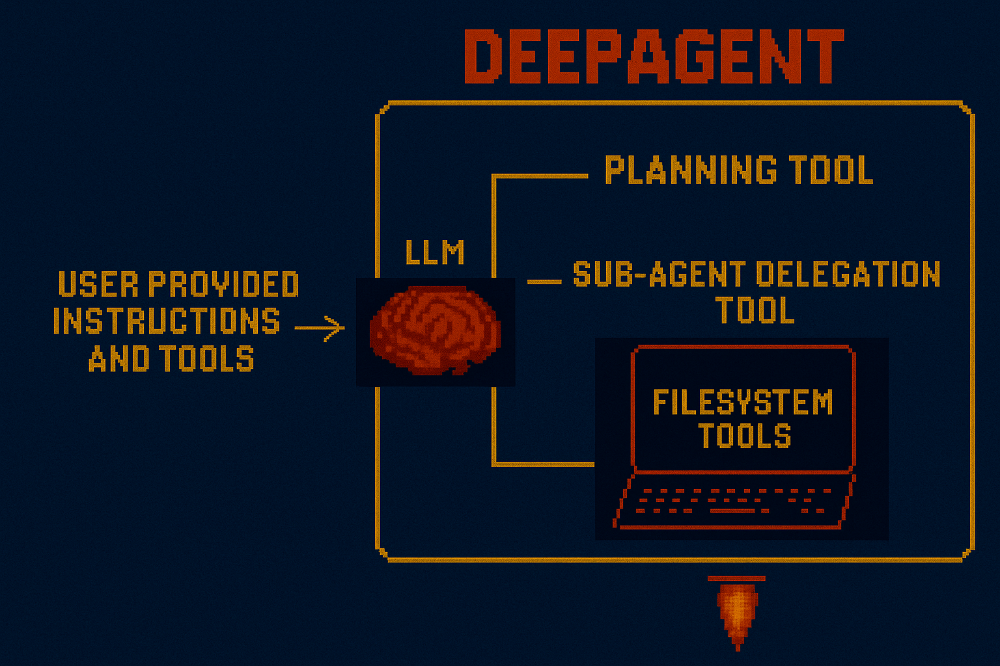

# 🚀🧠 Deep Agents

Agents can increasingly tackle long-horizon tasks, [with agent task length doubling every 7 months](https://metr.org/blog/2025-03-19-measuring-ai-ability-to-complete-long-tasks/)! But, long horizon tasks often span dozens of tool calls, which present cost and reliability challenges. Popular agents such as [Claude Code](https://code.claude.com/docs) and [Manus](https://www.youtube.com/watch?v=6_BcCthVvb8) use some common principles to address these challenges, including **planning** (prior to task execution), **computer access** (giving the agent access to a shell and a filesystem), and **sub-agent delegation** (isolated task execution). `deepagents` is a simple agent harness that implements these tools, but is open source and easily extendable with your own custom tools and instructions.


## 📚 Resources

- **[Documentation](https://docs.langchain.com/oss/python/deepagents/overview)** - Full overview and API reference
- **[Quickstarts Repo](https://github.com/langchain-ai/deepagents-quickstarts)** - Examples and use-cases
- **[CLI](libs/deepagents-cli/)** - Interactive command-line interface with skills, memory, and HITL workflows

## 🚀 Quickstart

You can give `deepagents` custom tools. Below, we'll optionally provide the `tavily` tool to search the web. This tool will be added to the `deepagents` build-in tools (see below).

```bash
pip install deepagents tavily-python
```

Set `TAVILY_API_KEY` in your environment ([get one here](https://www.tavily.com/)):

```python
import os
from deepagents import create_deep_agent

tavily_client = TavilyClient(api_key=os.environ["TAVILY_API_KEY"])

def internet_search(query: str, max_results: int = 5):
    """Run a web search"""
    return tavily_client.search(query, max_results=max_results)

agent = create_deep_agent(
    tools=[internet_search],
    system_prompt="Conduct research and write a polished report.",
)

result = agent.invoke({"messages": [{"role": "user", "content": "What is LangGraph?"}]})
```

The agent created with `create_deep_agent` is compiled [LangGraph StateGraph](https://docs.langchain.com/oss/python/langgraph/overview), so it can used it with streaming, human-in-the-loop, memory, or Studio just like any LangGraph agent. See our [quickstarts repo](https://github.com/langchain-ai/deepagents-quickstarts) for more examples.

## Customizing Deep Agents

There are several parameters you can pass to `create_deep_agent`.

### `model`

By default, `deepagents` uses `"claude-sonnet-4-5-20250929"`. You can customize this by passing any [LangChain model object](https://python.langchain.com/docs/integrations/chat/).

```python
from langchain.chat_models import init_chat_model
from deepagents import create_deep_agent

model = init_chat_model("openai:gpt-4o")
agent = create_deep_agent(
    model=model,
)
```

### `system_prompt`

You can provide a `system_prompt` parameter to `create_deep_agent()`. This custom prompt is **appended to** default instructions that are automatically injected by middleware.

When writing a custom system prompt, you should:

- ✅ Define domain-specific workflows (e.g., research methodology, data analysis steps)
- ✅ Provide concrete examples for your use case
- ✅ Add specialized guidance (e.g., "batch similar research tasks into a single TODO")
- ✅ Define stopping criteria and resource limits
- ✅ Explain how tools work together in your workflow

**Don't:**

- ❌ Re-explain what standard tools do (already covered by middleware)
- ❌ Duplicate middleware instructions about tool usage
- ❌ Contradict default instructions (work with them, not against them)

```python
from deepagents import create_deep_agent
research_instructions = """your custom system prompt"""
agent = create_deep_agent(
    system_prompt=research_instructions,
)
```

See our [quickstarts repo](https://github.com/langchain-ai/deepagents-quickstarts) for more examples.

### `tools`

Provide custom tools to your agent (in addition to [Built-in Tools](#built-in-tools)):

```python
from deepagents import create_deep_agent

def internet_search(query: str) -> str:
    """Run a web search"""
    return tavily_client.search(query)

agent = create_deep_agent(tools=[internet_search])
```

You can also connect MCP tools via [langchain-mcp-adapters](https://github.com/langchain-ai/langchain-mcp-adapters):

```python
from langchain_mcp_adapters.client import MultiServerMCPClient
from deepagents import create_deep_agent

async def main():
    mcp_client = MultiServerMCPClient(...)
    mcp_tools = await mcp_client.get_tools()
    agent = create_deep_agent(tools=mcp_tools)

    async for chunk in agent.astream({"messages": [{"role": "user", "content": "..."}]}):
        chunk["messages"][-1].pretty_print()
```

### `middleware`

Deep agents use [middleware](https://docs.langchain.com/oss/python/langchain/middleware) for extensibility (see [Built-in Tools](#built-in-tools) for defaults). Add custom middleware to inject tools, modify prompts, or hook into the agent lifecycle:

```python
from langchain_core.tools import tool
from deepagents import create_deep_agent
from langchain.agents.middleware import AgentMiddleware

@tool
def get_weather(city: str) -> str:
    """Get the weather in a city."""
    return f"The weather in {city} is sunny."

class WeatherMiddleware(AgentMiddleware):
    tools = [get_weather]

agent = create_deep_agent(middleware=[WeatherMiddleware()])
```

### `subagents`

The main agent can delegate work to sub-agents via the `task` tool (see [Built-in Tools](#built-in-tools)). You can supply custom sub-agents for context isolation and custom instructions:

```python
from deepagents import create_deep_agent

research_subagent = {
    "name": "research-agent",
    "description": "Used to research in-depth questions",
    "prompt": "You are an expert researcher",
    "tools": [internet_search],
    "model": "openai:gpt-4o",  # Optional, defaults to main agent model
}

agent = create_deep_agent(subagents=[research_subagent])
```

For complex cases, pass a pre-built LangGraph graph:

```python
from deepagents import CompiledSubAgent, create_deep_agent

custom_graph = create_agent(model=..., tools=..., prompt=...)

agent = create_deep_agent(
    subagents=[CompiledSubAgent(
        name="data-analyzer",
        description="Specialized agent for data analysis",
        runnable=custom_graph
    )]
)
```

See the [subagents documentation](https://docs.langchain.com/oss/python/deepagents/subagents) for more details.

### `interrupt_on`

Some tools may be sensitive and require human approval before execution. Deepagents supports human-in-the-loop workflows through LangGraph’s interrupt capabilities. You can configure which tools require approval using a checkpointer.

These tool configs are passed to our prebuilt [HITL middleware](https://docs.langchain.com/oss/python/langchain/middleware#human-in-the-loop) so that the agent pauses execution and waits for feedback from the user before executing configured tools.

```python
from langchain_core.tools import tool
from deepagents import create_deep_agent

@tool
def get_weather(city: str) -> str:
    """Get the weather in a city."""
    return f"The weather in {city} is sunny."

agent = create_deep_agent(
    model="anthropic:claude-sonnet-4-20250514",
    tools=[get_weather],
    interrupt_on={
        "get_weather": {
            "allowed_decisions": ["approve", "edit", "reject"]
        },
    }
)
```

See the [human-in-the-loop documentation](https://docs.langchain.com/oss/python/deepagents/human-in-the-loop) for more details.

### `backend`

Deep agents use pluggable backends to control how filesystem operations work. By default, files are stored in the agent's ephemeral state. You can configure different backends for local disk access, persistent cross-conversation storage, or hybrid routing.

```python
from deepagents import create_deep_agent
from deepagents.backends import FilesystemBackend

agent = create_deep_agent(
    backend=FilesystemBackend(root_dir="/path/to/project"),
)
```

Available backends include:

- **StateBackend** (default): Ephemeral files stored in agent state
- **FilesystemBackend**: Real disk operations under a root directory
- **StoreBackend**: Persistent storage using LangGraph Store
- **CompositeBackend**: Route different paths to different backends

See the [backends documentation](https://docs.langchain.com/oss/python/deepagents/backends) for more details.

### Long-term Memory

Deep agents can maintain persistent memory across conversations using a `CompositeBackend` that routes specific paths to durable storage.

This enables hybrid memory where working files remain ephemeral while important data (like user preferences or knowledge bases) persists across threads.

```python
from deepagents import create_deep_agent
from deepagents.backends import CompositeBackend, StateBackend, StoreBackend
from langgraph.store.memory import InMemoryStore

agent = create_deep_agent(
    backend=CompositeBackend(
        default=StateBackend(),
        routes={"/memories/": StoreBackend(store=InMemoryStore())},
    ),
)
```

Files under `/memories/` will persist across all conversations, while other paths remain temporary. Use cases include:

- Preserving user preferences across sessions
- Building knowledge bases from multiple conversations
- Self-improving instructions based on feedback
- Maintaining research progress across sessions

See the [long-term memory documentation](https://docs.langchain.com/oss/python/deepagents/long-term-memory) for more details.

## Built-in Tools



Every deep agent created with `create_deep_agent` comes with a standard set of tools:

| Tool Name | Description | Provided By |
|-----------|-------------|-------------|
| `write_todos` | Create and manage structured task lists for tracking progress through complex workflows | TodoListMiddleware |
| `read_todos` | Read the current todo list state | TodoListMiddleware |
| `ls` | List all files in a directory (requires absolute path) | FilesystemMiddleware |
| `read_file` | Read content from a file with optional pagination (offset/limit parameters) | FilesystemMiddleware |
| `write_file` | Create a new file or completely overwrite an existing file | FilesystemMiddleware |
| `edit_file` | Perform exact string replacements in files | FilesystemMiddleware |
| `glob` | Find files matching a pattern (e.g., `**/*.py`) | FilesystemMiddleware |
| `grep` | Search for text patterns within files | FilesystemMiddleware |
| `execute`* | Run shell commands in a sandboxed environment | FilesystemMiddleware |
| `task` | Delegate tasks to specialized sub-agents with isolated context windows | SubAgentMiddleware |

The `execute` tool is only available if the backend implements `SandboxBackendProtocol`. By default, it uses the in-memory state backend which does not support command execution. As shown, these tools (along with other capabilities) are provided by default middleware:

See the [agent harness documentation](https://docs.langchain.com/oss/python/deepagents/harness) for more details on built-in tools and capabilities.

## Built-in Middleware

`deepagents` uses middleware under the hood. Here is the list of the middleware used.

| Middleware | Purpose |
|------------|---------|
| **TodoListMiddleware** | Task planning and progress tracking |
| **FilesystemMiddleware** | File operations and context offloading (auto-saves large results) |
| **SubAgentMiddleware** | Delegate tasks to isolated sub-agents |
| **SummarizationMiddleware** | Auto-summarizes when context exceeds 170k tokens |
| **AnthropicPromptCachingMiddleware** | Caches system prompts to reduce costs (Anthropic only) |
| **PatchToolCallsMiddleware** | Fixes dangling tool calls from interruptions |
| **HumanInTheLoopMiddleware** | Pauses execution for human approval (requires `interrupt_on` config) |

## Built-in prompts

The middleware automatically adds instructions about the standard tools. Your custom instructions should **complement, not duplicate** these defaults:

#### From [TodoListMiddleware](https://github.com/langchain-ai/langchain/blob/master/libs/langchain/langchain/agents/middleware/todo.py)

- Explains when to use `write_todos` and `read_todos`
- Guidance on marking tasks completed
- Best practices for todo list management
- When NOT to use todos (simple tasks)

#### From [FilesystemMiddleware](libs/deepagents/deepagents/middleware/filesystem.py)

- Lists all filesystem tools (`ls`, `read_file`, `write_file`, `edit_file`, `glob`, `grep`, `execute`*)
- Explains that file paths must start with `/`
- Describes each tool's purpose and parameters
- Notes about context offloading for large tool results

#### From [SubAgentMiddleware](libs/deepagents/deepagents/middleware/subagents.py)

- Explains the `task()` tool for delegating to sub-agents
- When to use sub-agents vs when NOT to use them
- Guidance on parallel execution
- Subagent lifecycle (spawn → run → return → reconcile)
