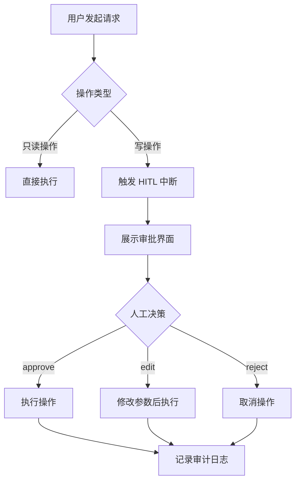

# NetBox Agent HITL 审批功能说明

## 概述

NetBox Agent 已配置 **HITL (Human-in-the-Loop)** 审批机制，确保所有写操作都需要人工批准后才能执行。

## 审批配置

### 位置
`src/olav/agents/netbox_agent.py` - `create_netbox_subagent()` 函数

### 配置代码
```python
interrupt_on={
    "netbox_api_call": {
        # 只有写操作需要审批（POST/PUT/PATCH/DELETE）
        "condition": lambda args: args.get("method", "GET").upper() in ["POST", "PUT", "PATCH", "DELETE"],
        "allowed_decisions": ["approve", "edit", "reject"]
    },
    "import_devices_from_csv": {
        # CSV 导入属于批量写操作，必须审批
        "allowed_decisions": ["approve", "edit", "reject"]
    }
}
```

## 需要审批的操作

### 1. NetBox API 写操作 (`netbox_api_call`)
触发条件：method 参数为 POST/PUT/PATCH/DELETE

**示例场景**：
- ✅ **需要审批**：`netbox_api_call(path="/dcim/devices/", method="POST", data={...})` - 创建设备
- ✅ **需要审批**：`netbox_api_call(path="/dcim/devices/1/", method="PATCH", data={...})` - 更新设备
- ✅ **需要审批**：`netbox_api_call(path="/dcim/devices/1/", method="DELETE")` - 删除设备
- ❌ **无需审批**：`netbox_api_call(path="/dcim/devices/", method="GET")` - 查询设备（只读）

### 2. CSV 批量导入 (`import_devices_from_csv`)
触发条件：任何调用（批量写操作，风险高）

**示例场景**：
```python
csv_content = """name,device_role,device_type,site,platform,status
R1,router,IOSv,DC1,cisco_ios,active
SW1,switch,vEOS,DC1,arista_eos,active"""

# 调用此工具会触发 HITL 审批
import_devices_from_csv(csv_content)
```

**操作影响**：
- 创建/检查站点 (DC1)
- 创建/检查角色 (router, switch)
- 创建/检查设备类型 (IOSv, vEOS)
- 创建/检查制造商 (Generic)
- 创建/检查平台 (cisco_ios, arista_eos)
- 创建 2 台设备

### 3. 无需审批的操作

以下操作是只读的，不需要 HITL 审批：

- ✅ `netbox_schema_search()` - 搜索 API 端点
- ✅ `query_netbox_devices()` - 查询设备清单
- ✅ `netbox_api_call(..., method="GET")` - GET 请求
- ✅ `sync_device_configs()` - 配置同步（仅生成配置文件，不修改 NetBox）

## 审批流程

### 1. 执行流程



### 2. 审批界面示例

当触发 HITL 时，LangGraph 会暂停执行并向用户展示：

```
⚠️  需要人工审批

操作类型: 创建设备
API 端点: POST /api/dcim/devices/
工具: netbox_api_call

设备信息:
{
  "name": "R10",
  "site": {"name": "DC1"},
  "device_type": {"model": "IOSv"},
  "role": {"name": "router"},
  "platform": {"name": "cisco_ios"},
  "status": "active"
}

影响范围: 
- 将在 NetBox 中创建 1 台新设备
- Nornir 和 SuzieQ 将在下次同步时发现此设备

请选择: 
  [1] approve - 批准执行
  [2] edit    - 修改参数后执行
  [3] reject  - 拒绝操作
```

### 3. 决策选项说明

| 选项 | 说明 | 效果 |
|------|------|------|
| **approve** | 批准按原计划执行 | 使用原参数执行操作 |
| **edit** | 编辑参数后执行 | 修改设备名称、IP 等后再执行 |
| **reject** | 拒绝操作 | 取消操作，不执行任何更改 |

## 实际使用示例

### 场景 1：查询设备（无需审批）

```python
# 用户查询
"查询 NetBox 中所有路由器设备"

# Agent 执行流程
1. 调用 query_netbox_devices(role="router")
2. 直接返回结果（无 HITL 中断）

# 输出
设备清单:
- R1 (cisco_ios, 192.168.1.1/24)
- R2 (juniper_junos, 192.168.1.2/24)
```

### 场景 2：创建设备（需要审批）

```python
# 用户请求
"在 NetBox 中创建一台新路由器 R10"

# Agent 执行流程
1. 调用 netbox_api_call(path="/dcim/devices/", method="POST", ...)
2. 触发 HITL 中断 ⚠️
3. 等待人工批准
4. 如果批准 → 创建设备 → 返回结果
5. 如果拒绝 → 取消操作 → 告知用户

# 审批界面
⚠️  需要人工审批
操作: 创建设备 R10
站点: DC1
平台: cisco_ios
...
请选择: approve / edit / reject

# 用户选择 approve
✅ 操作已批准，设备 R10 创建成功
```

### 场景 3：CSV 批量导入（需要审批）

```python
# 用户请求
"从 CSV 导入以下设备: ..."

# Agent 执行流程
1. 调用 import_devices_from_csv(csv_content)
2. 触发 HITL 中断 ⚠️
3. 展示导入预览（将创建哪些对象）
4. 等待人工批准
5. 批准后执行批量导入

# 审批界面
⚠️  需要人工审批
操作: CSV 批量导入
设备数量: 10 台
将创建:
  - 站点: 3 个
  - 角色: 2 个
  - 设备类型: 5 个
  - 平台: 4 个
  - 设备: 10 台

风险评估: 中等（批量操作）
建议: 建议先审查 CSV 数据完整性

请选择: approve / edit / reject
```

## 审计日志

所有操作（包括批准/拒绝的决策）都会记录到 OpenSearch 审计日志：

```json
{
  "timestamp": "2025-11-21T21:00:00Z",
  "action": "netbox_write_operation",
  "user": "operator",
  "tool": "netbox_api_call",
  "method": "POST",
  "path": "/api/dcim/devices/",
  "decision": "approved",
  "approved_by": "admin",
  "data": {...},
  "result": "success"
}
```

## 安全优势

1. **防止误操作**：所有写操作都需要二次确认
2. **合规要求**：满足企业级审计和批准流程
3. **变更追踪**：所有操作都有审计记录
4. **权限控制**：可以基于角色配置不同的审批策略
5. **风险评估**：在执行前可以评估操作影响范围

## 配置文件位置

- **Agent 配置**: `src/olav/agents/netbox_agent.py`
- **Prompt 配置**: `config/prompts/agents/netbox_agent.yaml`
- **工具实现**: `src/olav/tools/netbox_inventory_tool.py`

## 测试

运行测试脚本验证 HITL 配置：
```bash
uv run python scripts/test_netbox_agent.py
```

## 相关文档

- DeepAgents HITL 文档: `archive/deepagents/docs/`
- LangGraph Interrupt 机制: https://langchain-ai.github.io/langgraph/
- OLAV 架构设计: `docs/DESIGN.md`
